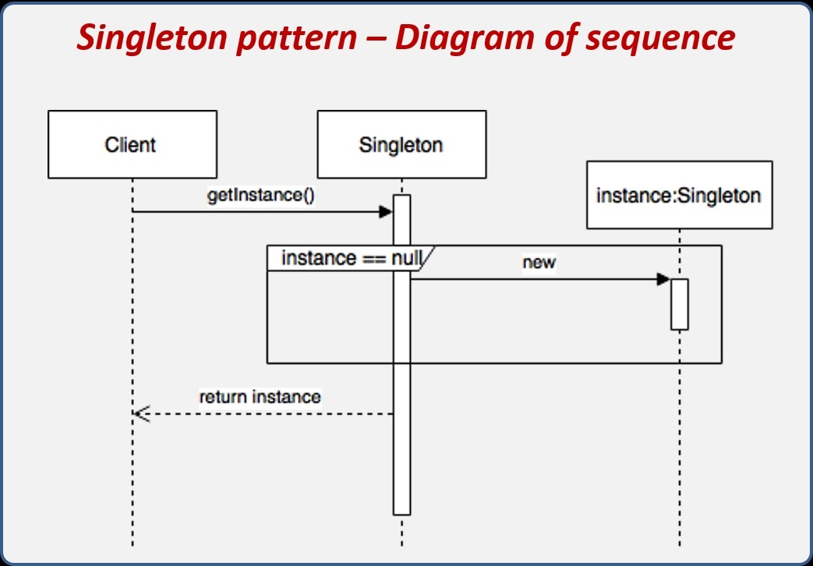
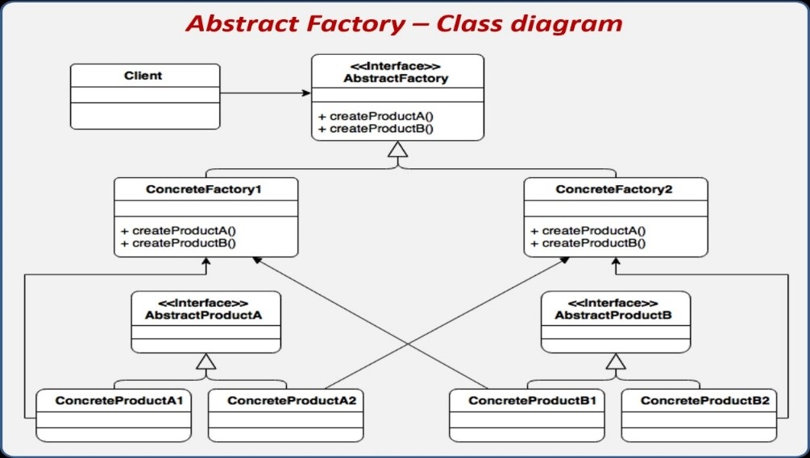
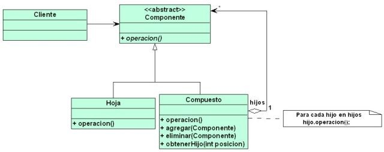
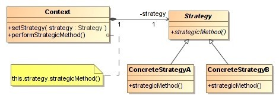
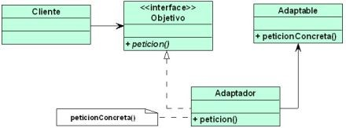
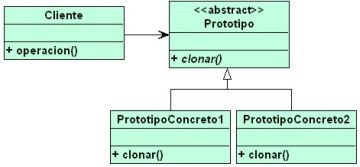
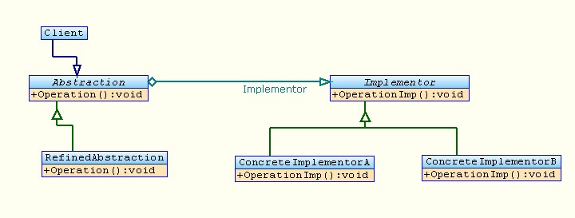
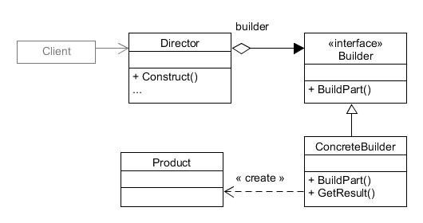

# SaposyRanas

    

        Videojuego “Sapos y Ranas” en C++ para consola
    

    Este es el trabajo resultante del semestre 01/2020, que fue desarrollado por un equipo conformado por el docente de la asignatura y un grupo de estudiantes:
        
   <ul>
        <li>
            Docente: Ing. Carlos Walter Pacheco Lora
        </li>
   </ul>
   <ul>
       <li>
            Univ. Acebey Laime Martin Andres 
       </li>
       <li>
            Univ. Berrios Escalera Abril Johana
       </li>
       <li>
            Univ. Gonzales Tito Sebastian
       </li>
       <li>
            Univ. Taboada Chuve Alexy Sdenka
       </li>
       <li> 
            Univ. Villca Saigua Raul Carmelo
    </li>
       <li>
            Univ. Limachi Carrillo Grover Tomas
       </li>
       <li>
            Univ. Peñafiel Picha Erick Martín
       </li>
 </ul>
 

    El videojuego “Sapos y Ranas” elaborado en la materia de “Programación
    Avanzada” de la universidad Mayor, Real y Pontificia de San Francisco
    Xavier, está basado en el videojuego árcade clásico “Frogger”, que consiste
    en llevar a una rana a través de ciertos obstáculos evitando que muera.

    Para la construcción del juego se utilizó diferentes patrones listados a
    continuación:

<li>  Abstract factory
    </li>
    <li>
        Adapter
    </li>
    <li>
        Bridge
    </li>
    <li>
        Builder
    </li>
    <li>
        Composite
    </li>
    <li>
        Factory Method
    </li>
    <li>
        Prototype
    </li>
    <li>
        Singleton
    </li>
    <li>
        Strategy
    </li>
</ul>

    Para una mejor organización de los clases que componen el juego, se las
    dividió en diferentes carpetas:

<ul>
    <li>
        <strong>Actores: </strong>
        En esta carpeta se encuentran todo lo referente a los diferentes
        personajes del videojuego, su representación visual e incluido el
        movimiento que realizaran.<strong></strong>
    </li>
    <li>
        <strong>Escenario:</strong>
        Aquí esta organizado todo lo que es referente a la visualización del
        escenario, los diferentes objetos que aparecerán en el (Bloques,
        Espinas, CubosEnergia).<strong></strong>
    </li>
    <li>
        <strong>InterfazTexto:</strong>
        En esta carpeta se puede encontrar todas las clases referentes a la
interfaz visual, al menú y al funcionamiento del videojuego.        <strong></strong>
    </li>
</ul>
<h1>
    Patrón Singleton
</h1>

    Este patrón limita el número de instancias posibles de una clase en nuestro
    programa.

    Su intención consiste en garantizar que una clase solo tenga una instancia
    y proporcionar un punto de acceso global a ella.

    

    En el juego se implementa este patrón a la clase GameManager para limitar
    una solo instancia de esta clase, para ello en GameManager.h se declaran la
    variable instancia estática de tipo GameManager en esta variable se
    almacenará la instancia, declaramos constructor privado para evitar
    instancias y declaramos el método acceso getInstancia estática de tipo
    GameManager. En el GameManager.cpp implementamos el patrón donde la
    variable instancia igualamos a cero por que la instancia se inicializara
    bajo demanda y en el método getInstancia almacenamos y retornamos la
    instancia de la clase en la variable instancia.

    El las clases NivelAvanzado.h, NivelBasico.h y NivelMedio.h llamamos al
    método accesor getInstancia en vez de instanciar la clase.

    <strong>GameManager.h</strong>

    class GameManager {

    //simgleton de GameManager

    private:

    static GameManager* instancia; //aqui es donde se almacenara la instancia

    GameManager(); //constructor privado para evitar instancias

    public:

    static GameManager* getInstancia(); //metodo accesor estatico de instancia

    }

    <strong>GameManager.cpp</strong>

    <strong></strong>

    //implementacion del singleton

    GameManager* GameManager::instancia = 0; //nulo por que la instancia se
    inicializara bajo demanda

    GameManager* GameManager::getInstancia() { //metodo accesor donde gurdamos
    la instancia no se podra instanciar mietras no se llame al metodo

    if (instancia == 0) {

    instancia = new GameManager();

    }

    return instancia;

    }

    GameManager::GameManager() {}

    Llamamos al método getInstacia en las clases NivelAvanzado, NivelBasico y
    NivelIntermedio

<h1>
    Patrón Abstract Factory (Fabrica Abstracta)
</h1>

    Este patrón nos provee un método (interfaz) que delega la creación de un
    conjunto de objetos relacionados busca agrupar un conjunto de clases que
    tiene un funcionamiento en común.

    
    En el Juego se implementa el patrón para fabricar actores, donde la clase
    Actor es una clase abstracta es abstracta porque tiene un método virtual
    int dano()=0 esta clase es la clase padre que tiene sus respectivos
    atributos , métodos y métodos acceso res. Donde las clases hijas Auto,
    Cocodrilo, Mosca, Sapo, Tortuga y Tronco heredan de clase padre Actor y el
    método virtual dano() se sobre escribe obligatoriamente en todas las clases
    hijas.

    La Clase padre FabricaActor abstracta tiene atributos y los métodos
    virtuales de tipo Actor (ej. Virtual Actor* crearSapo()=0) estos métodos
    creados sobrecargaran (se sobre escribirá) obligatoriamente las diferentes
    fabricas especializadas, como FabricaActorNivelAvanzado,
    FabricaActorNivelBasico y FabricaActorNivelMedio son clases hijas que
    heredan de la clase padre FabricaActor que a la ves estas clase hijas tiene
    su propios atributos privado.

    La creación de los objetos es gracias a los métodos virtuales mencionados
    anteriormente, que relacionan a las tres clases que tienen funcionamiento
    en común.

    Las clases que heredan de la clase actor son todos las actores del juego
    son parte de la aplicación del patrón Abstract Factory

    Clase abstracta para la aplicación del patrón que contiene
    métodos(interfaz) para la creación de un conjunto de objetos.

    <strong>FabricaActor.h</strong>

    /*esta es la interfaz necesaria en abstract Factory -&gt;clase padre
    abstracta*/

    class FabricaActor {

    public:

    //constructor de la clase

    FabricaActor() {

    anchoTortuga = anchoCorrect(avatarTortuga);

    anchoCocodrilo = anchoCorrect(avatarCocodrilo);

    anchoAuto1 = anchoCorrect(avatarAuto1);

    anchoAuto2 = anchoCorrect(avatarAuto2);

    anchoTronco = anchoCorrect(avatarTronco);

    }

    //creando metodos que las fabrizas especializadas sobrecargaran
    obligatoriamente

    virtual Actor* CrearSapo(int _x, int _y, int _dx, int _dy,
    MapaElementosPantalla* m) = 0;

    virtual Actor* CrearCocodrilo(int _x, int _y, int _dx, int _dy,
    MapaElementosPantalla* m) = 0;

    virtual Actor* CrearAuto1(int _x, int _y, int _dx, int _dy,
    MapaElementosPantalla* m) = 0;

    virtual Actor* CrearAuto2(int _x, int _y, int _dx, int _dy,
    MapaElementosPantalla* m) = 0;

    virtual Actor* CrearTortuga(int _x, int _y, int _dx, int _dy,
    MapaElementosPantalla* m) = 0;

    virtual Actor* CrearTronco(int _x, int _y, int _dx, int _dy,
    MapaElementosPantalla* m) = 0;

    Las clases FabricaActorNivelAvanzado, FabricaActorNivelBasico y
    FabricaActorNivelMedio Sobrecargan los métodos creados en
    FabricaActor(clase padre) para su posterior fabrica de actores

    Ejemplo :

    FabricaActorNivelAvanzado.h

    #include "FabricaActor.h"

    //clase hija que hereda de la clase padre fabricaActor relacionados que
    tienen un funcionamiento en común(aplicando el patron Abstrac Fatory)

    class FabricaActorNivelAvanzado :public FabricaActor {

    private:

    //atributos privados propios de la clase estaticos

    static int NumeroEnemigosA1;

    static int NumeroEnemigosA2;

    static int NumeroEnemigosA3;

    static int NumeroEnemigosA4;

    static int NumeroEnemigosA5;

    public:

    //sobrecarga de metodos de la clase padre obligatorio

    Actor* CrearSapo(int _x, int _y, int _dx, int _dy, MapaElementosPantalla*
    m);

    Actor* CrearCocodrilo(int _x, int _y, int _dx, int _dy,
    MapaElementosPantalla* m);

    Actor* CrearAuto1(int _x, int _y, int _dx, int _dy, MapaElementosPantalla*
    m);

    Actor* CrearAuto2(int _x, int _y, int _dx, int _dy, MapaElementosPantalla*
    m);

    Actor* CrearTortuga(int _x, int _y, int _dx, int _dy,
    MapaElementosPantalla* m);

    Actor* CrearTronco(int _x, int _y, int _dx, int _dy, MapaElementosPantalla*
    m);

    };

    }

    En la clase FabricaActorNivelAvanzado.cpp solo se esta instanciando los
    actores, y se está retornando.

<h1>
    Patrón Composite
</h1>

    El patrón de diseño Composite nos sirve para construir estructuras
    complejas partiendo de otras estructuras mucho más simples, dicho de otra
    manera, podemos crear estructuras compuestas las cuales están conformadas
    por otras estructuras más pequeñas.

    
    Compone objetos en estructuras de árbol para jerarquías de parte-todo.
    Permite que los clientes traten de manera uniforme a los objetos
    individuales y a los compuestos.

<h2>
    Participantes
</h2>

    · Componente: Generalmente es una interface o clase abstracta la cual tiene
    las operaciones mínimas que serán utilizadas, este componente deberá ser
    extendido por los otros dos componentes, hojas, y compuestos.

    · Hoja: Representa la parte más simple o pequeña de toda la estructura.

    · Compuesto: Define el comportamiento de los componentes hijo, almacena a
    componentes hijos, implementa las operaciones de la interfaz Componente
    relacionadas con los hijos

    El componente en el juego es la clase ComponenteIT.h que esta heredando de
    ObjetoIt.h todas sus características.

    En el juego se define una clase Composite.h que podrá manejar cualquier
    tipo de componente usando template, de esta clase podrá contener otras
    clases hijas de tipo componente ya definiendo sus métodos para poder
    agregar hijos o eliminarlos y acceder a ellos.

    Como el patrón composite puede tener otras hojas tipo composite y estos
    mismos pueden tener otros componentes compuestos.

    using namespace std;

    // El template maneja cualquier tipo de clase

    template&lt;typename Componente&gt;

    // Se está creando la clase componente que desciende de un template tipo
    componente

    class Composite : public Componente

    {

    protected:

    //Va a almacenar hijos de tipo componente

    vector&lt;Componente*&gt; hijos; //Lista de los hijos componentes.

    public:

    // Se crea un tipo de dato que valga igual
    vector&lt;Componente*&gt;::iterator

    Typedef typename vector&lt;Componente*&gt;::iterator IteradorHijo;

    // Método para añadir un hijo

    void AgregarHijo(Componente* hijo)

    {

    // Le pasa un hijo tipo componente

    // se busca de principio a fin buscando hijo

    // Si lo encuentra lo guarda en itr

    // Si no manda la dirección final y añade

    IteradorHijo itr = find(hijos.begin(), hijos.end(), hijo);

    if (itr == hijos.end())

    {

    hijos.push_back(hijo);

    }

    }

    void EliminarHijo(Componente* hijo)

    {

    IteradorHijo itr = find(hijos.begin(), hijos.end(), hijo);

    if (itr != hijos.end())

    {

    hijos.erase(itr);

    }

    }

    void VaciarHijos()

    {

    hijos.clear();

    }

    };

    Las hojas de este Composite seria: Panel.h, Marcador.h, Botón.h, Marco.h,
    Etiqueta.h, Menu.h, Panel.h; cada uno de estos puede contener sus propias
    hojas (hijos), además que cada uno tiene sus propios atributos y métodos.

    En Interfaz.cpp se añaden unos dentro de otros formando parte del Interfaz
    de texto.

<h1>
    Patrón Strategy
</h1>

    
    Es una alternativa a la herencia múltiple. Las estrategias permiten
    configurar una clase con un determinado comportamiento de entre muchos
    posibles. Se Implementa cuando se necesitan distintas variantes de un
    algoritmo. En lugar de tener muchas condicionales, podemos mover las ramas
    de estos a sus propias estrategias.

<h2>
    Participantes
</h2>

    · Estrategia: Declara una interfaz común a todos los algoritmos permitidos.
    El contexto usa esta interfaz para llamar al algoritmo definido por una
    Estrategia Concreta.

<ul>
    <li>
        Estrategia concreta
    </li>
</ul>

    · Contexto: Se configura con un objeto estrategia Concreta. Mantiene una
    referencia a un objeto estrategia Puede definir una interfaz que permite a
    la Estrategia acceder a sus datos.

    En el juego se implementa el patrón strategy con las clases: ObjetoIT.h,
    NivelBasico.h, NivelMedio.h, NivelAvanzado.h, ObjetoSalir.h,
    SelecciónObjetoIT.h.

    Ø <strong><em>Estrategia</em></strong> (SelecciónObjetoIT.h)

    Definimos la interfaz Strategy de la cual crearemos estrategias puntuales
    (presEnter() y fin()) para cada caso.

    // clase Abstracta para seleccionar un objeto

    class SeleccionObjetoIT

    {

    public:

    virtual void presEnter() = 0;

    virtual bool fin() = 0;

    };

    Ø <strong><em>Estrategia Concreta </em></strong>(NivelBasico.h,
    NivelMedio.h, NivelAvanzado.h, SeleccionSalir.h)

    Son las implementaciones de las estrategias, cada nivel será una diferente
    variante de las estrategias puntuales.

    Ejemplos:

    // nivel de dificultad del juego basico

    class NivelBasico :

    public SeleccionObjetoITh

    {

    public:

    FabricaActor* faNivelBasico = new FabricaActorNivelBasico;

    GameManager* gm01 = GameManager::getInstancia();

    void presEnter() {

    gm01-&gt;IniciarJuego(faNivelBasico);

    }

    bool fin() {

    return gm01-&gt;fin();

    }

    };

    //--------------------------------------------------------------------------

    // desciende de SeleccionObjetoIT

    class ObjetoSalir :

    public SeleccionObjetoIT

    {

    public:

    bool pres = false;

    void presEnter() {

    pres = true;

    }

    bool fin() {

    return pres;

    }

    };

    Ø <strong><em>Contexto </em></strong>(ObjetoIT.h)

    #pragma once

    #include "SeleccionObjetoIT.h"

    // clase abstracta de la cual heredaran sus componentes sus clases hijas

    class ObjetoIT

    {

    // Propiedades generales que tiene un objeto

    private:

    int x;

    int y;

    int ancho;

    int alto;

    int colorFondoBase;

    int colorCaracterBase;

    char caracterBase;

    bool seleccionado;

    bool visible;

    SeleccionObjetoIT* seleccion;

    public:

    //se crean constructores según la utilidad

    ObjetoIT(int _x, int _y, int _ancho, int _alto, int _colorFondoBase, int
    _colorCaracterBase, char _caracterBase);

    ObjetoIT(int _x, int _y);

    ObjetoIT() {};

    ------------------------------------------

    //permite definir el método seleccionado

    void setSeleccionObjetoIT(SeleccionObjetoIT* _obj) { seleccion = _obj; }

    //permite acceder a sus datos

    virtual void preEnter();

    void ObjetoIT::preEnter()

    {

    seleccion-&gt;presEnter();

    }

    <strong></strong>

    virtual bool fin();

    {

    return seleccion-&gt;fin()

    }

    ----------------------------------------

    virtual void Mostrar() = 0;

    // se crean sus métodos de acceso

<h1>
    Patrón Adapter
</h1>

    Este patrón permite a dos clases con diferentes interfaces trabajar entre
    ellas a través de un objeto intermedio con el que se comunican e
    interactúan.

    Para ello, un objeto adaptador reenvía al otro objeto los datos que recibe
    (a través de los métodos que implementa, definidos en una clase abstracta o
    interface) tras manipularlos en caso necesario.

    Este patrón se aplicó para el actor águila donde las clases que interactúan
son <strong>Actor, Águila y AguilaAdapter. </strong>Las clases    <strong>Actor y Águila</strong> trabajan entre ellas, aunque tengan
interfaces diferentes donde se comunican por la clase    <strong>AguilaAdapter </strong>trabaja como objeto intermedio donde
    interactúan atreves se ella.

<table cellpadding="0" cellspacing="0">
    <tbody>
        <tr>
            <td width="321" height="0">
            </td>
        </tr>
        <tr>
            <td>
            </td>
            <td>
                
            </td>
        </tr>
    </tbody>
</table>
 

    La clase

<strong>AguilaAdapter</strong>

    hace herencia de las clases padres

<strong>Actor y Aguila</strong>

    donde hereda sus atributos y el método mostrar de Actor, ya que de la misma
    manera puede heredar de la clase Águila ya estas interactúan entre ellas.

    Las clases Águila y AguilaAdapter están excluidos del proyecto por razones
    de que este actor no se esta incluido en el juego, pero de esa manera se
    implementa este patrón si se desea implementar.

    <strong>Aguila.h</strong>

    class Aguila

    {

    //atributos propios de la clase de tipo privado

    private:

    string NombreAguila;

    string RepresentacionVisual;

    int PosicionXI;

    int PosicionXD;

    int PosicionYS;

    int PosicionYI;

    public:

    //constructor de la clase publica

    Aguila(string Nombre, string RepresentacionVisual, int _PosicionXI, int
    _PosicionXD, int _PosicionYS, int PosicionYI);

    //metodos publicos declarados de la clase

    void VisualizarEnPantalla();

    void AtraparAnimal() {};

    };

    <strong>Aguila.cpp</strong>

    Aguila::Aguila(string _NombreAguila, string _RepresentacionVisual, int
    _PosicionXI, int _PosicionXD, int _PosicionYS, int _PosicionYI) :
    NombreAguila(_NombreAguila), RepresentacionVisual(_RepresentacionVisual),

    PosicionXI(_PosicionXI), PosicionXD(_PosicionXD),

    PosicionYS(_PosicionYS), PosicionYI(_PosicionYI)

    {

    }

    void Aguila::VisualizarEnPantalla()

    {

    gotoxy(PosicionXI, PosicionYI);

    cout &lt;&lt; RepresentacionVisual &lt;&lt; "\nBBBBB" &lt;&lt; "\nAAAAAA"
    &lt;&lt; endl;

    }

    AguilaAdapter.h esta clase hace herencia de las clases Actor y Aguila donde
    trabajan juntas

    #include "Actores.h"

    #include "Aguila.h"

    //clase hija que interactua como objeto intermedio para que las clases
    actor y Aguila trabajen entre ellas

    class AguilaAdapter :

    public Actores, public Aguila

    {

    public:

    //contructor de la clase

    AguilaAdapter(vector&lt;string&gt; _avatar, int _x, int _y, int _dx, int
    _dy, int _limiteSuperior, int _limiteInferior, int _limiteIzquierda, int
    _limiteDerecha, MapasCaracteres* _mce);

    void Mostrar();//metodo heredado de actor

    void MostrarInformacionClase();//metodo propio de la clase

    //metodo inline de representacion visual del avatar de tipo string que
    retorna valor del mismo tipo

    inline string AvatarARepresentacionVisual(vector&lt;string&gt; _avatar) {

    string rvt = "";

    for (int i = 0; i &lt; _avatar.size(); i++) {

    for (int j = 0; j &lt; _avatar[i].length(); j++) {

    rvt = rvt + _avatar[i][j];

    }

    //rvt = rvt + '\n';

    }

    return rvt;

    }

    AguilaAdapter.cpp

    #include "AguilaAdapter.h"

    //inplementacion del constructor de la clase

    AguilaAdapter::AguilaAdapter(vector&lt;string&gt; _avatar, int _x, int _y,
    int _dx, int _dy, int _limiteSuperior, int _limiteInferior, int
    _limiteIzquierda, int _limiteDerecha, MapasCaracteres* _mce)
    :Aguila("NombreAguila", AvatarARepresentacionVisual(_avatar), _x, _x + 5,
    _y, _y), Actores(_avatar, _x, _y, _dx, _dy, _limiteSuperior,
    _limiteInferior, _limiteIzquierda, _limiteDerecha, _mce) {

    }

    //inplementacion del metodo heredado de actor

    void AguilaAdapter::Mostrar()

    {

    VisualizarEnPantalla();

    }

    //inplementacion del metodo propio de la clase

    void AguilaAdapter::MostrarInformacionClase()

    {

    }

<h1>
    Patrón de Creación – Factory Method
</h1>

    Este patrón de creación define una interfaz para crear un objeto, pero
    delega la creación del objeto a sus subclases. En la aplicabilidad que se
    le puede dar a este patrón, se la puede usar cuando no se puede prever
    cuantas clases de objetos serán utilizados y cuando se quiere delegar su
    creación a una interfaz que los vaya manejando.

    Para comenzar a utilizar el patrón Factory Method, se requiere de una clase
    que sea el creador con una función static que se encargará de devolver el
    objeto que sea requerido, en este caso del videojuego “Sapos y Ranas” el
    creador será la clase Objetos, una clase abstracta de la cual se heredara
    el método Mostrar que es una función virtual pura, esta clase se define de
    la siguiente forma:

    <strong>
        Implementación del constructor y el método static (Objeto.cpp)
    </strong>

    //Aquí se puede observar la implementación de la función static que creara
    los objetos según el "tipoObjeto" que se le mande y retornara ese objeto
    creado con los diferentes valores que requiere el cliente"

    Objetos* Objetos::getObjeto(string _tipoObjeto, int _x, int _y, int _ancho,
    int _alto)

    {

    if (_tipoObjeto == "Espina")

    return new Espinas(1, "espina01", _x, _y, _ancho, _alto, 'X', 0);

    else if (_tipoObjeto == "Bloque")

    return new Bloques(1, "bloque01", _x, _y, _ancho, _ancho, '#', 0, 0);

    else if (_tipoObjeto == "CuboEnergia")

    return new CubosEnergia(1, "cuboenergia01", _x, _y, _ancho, _alto, '@', 5,
    1);

    else

    return NULL;

    }

    <strong></strong>

    Como puede observarse en el código, es necesario definir e implementar una
    función static que será la interfaz de creación de los diferentes objetos,
    en base al tipo de objeto que se requiera.

    Y para finalizar su implementación en el cliente (GameManager) se hace de
    la siguiente manera:

    <strong>GameManager.h</strong>

    <strong>
         
    </strong>
    //Para facilitar la visualización de este objeto se crea una lista que
    almacenara los diferentes objetos creados<strong></strong>

    list&lt;Objetos*&gt; listaObjetos;

    <strong>Implementación del patrón – GameManager.cpp</strong>

    <strong></strong>

    //Para la creacion de este objeto se puede observar como se le pasa el tipo
    de objeto requerido y se lo añade a la lista

    listaObjetos.push_back(Objetos::getObjeto("Espina", 5, 15, 4, 3));

    listaObjetos.push_back(Objetos::getObjeto("Bloque", 20, 4, 10, 5));

    listaObjetos.push_back(Objetos::getObjeto("CuboEnergia", 50, 4, 1, 1));

    Como se puede observar la implementación de este patrón es sencilla, pero
    se excluye del juego ya que los diferentes objetos que son requeridos en el
    juego como ser: “Espinas”, “CubosEnergia” y “Bloque”, ya han sido
    implementados con el patrón Builder y se crean a partir de ahí, sin
    embargo, este es otra opción con la cual se puede obtener el mismo
    resultado.

<h1>
    Prototype
</h1>

    Permite crear objetos prediseñados sin conocer detalles de cómo crearlos.
    Esto lo logra especificando los prototipos de objetos a crear. El concepto
    de este patrón es simple: en lugar de crear un objeto, se clona, es decir,
    se realiza una copia exacta de otro objeto dado, el cual tiene como
    finalidad crear nuevos objetos duplicándolos, clonando una instancia creada
    previamente, lo cual permite reducir la herencia y la cantidad de clases
    innecesarias.

    
    Uno de los puntos del patrón es que un programa puede dinámicamente añadir
    y borrar objetos prototipo en tiempo de ejecución. Esta es una ventaja que
    no ofrece ninguno de los otros patrones de creación, esto mismo esconde los
    nombres de los productos específicos al cliente.

<h2>
    Implementación en el código
</h2>

    Para la implementación de este patrón creamos las clases, que
    relacionándolo con el esquema tenemos:

<ul>
    <li>
        Potenciadores (abstract)
    </li>
</ul>

    · PotenciadoresConcretosTipo1 (PrototipoConcreto1)

    · PotenciadoresConcretosTipo2 (PrototipoConcreto2)

    Clase Potenciadores:

    Para la implementación del patrón la clase debe ser una clase abstracta, el
    cual nos permite clonar, esta debe ser de tipo virtual puro, es decir, que
    no se puede declarar en la clase Potenciadores, pero sí de forma obligada
    en sus clases hijas.

    class Potenciadores :

    public Objetos

    {

    private:

    string tipo;

    int velocidad;

    int salto;

    int energia;

    int escudo;

    int vidas;

    public:

    //Constructor

    Potenciadores(int _x, int _y, int _ancho, int _alto, char _caracter, int
    _colorFondo, int _colorCaracter, MapaElementosPantalla* _mc,

    int _velocidad, int _salto, int _energia, int _escudo, int _vidas);

    //acorde al patron prototype, debemos crear un metodo de tipo virtual y
    abstracto para poder clorar

    virtual Potenciadores* Clonar() = 0;

    void Mostrar();}

    Dentro de las clases Hijas:

    Dentro del constructor luego de definir los parámetros concretos que se
    está utilizando para una determinada clase, definimos un método asesor”
    setTipo” que permita determinar el tipo concreto que es, esta puede ser un
    entero, string, etc.

    Dentro del método Clonar, retorna un nuevo objeto de la clase donde está
    definido el método clon, a esta se le pasa un puntero que hace referencia a
    todos los parámetros que recibe en la clase.

    PotenciadoresContretosTipo1::PotenciadoresContretosTipo1(int _x, int _y,
    int _ancho, int _alto, char _caracter, int _colorFondo, int _colorCaracter,
    MapaElementosPantalla* _mc,int _velocidad, int _salto, int _energia, int
    _escudo, int _vidas) :Potenciadores(_x, _y, _ancho, _alto, _caracter,
    _colorFondo, _colorCaracter, _mc, _velocidad, _salto, _energia, _escudo,
    _vidas)

    {

    setTipo("PotenciadorTipo1");

    }

    Potenciadores* PotenciadoresContretosTipo1::Clonar()

    {

    return new PotenciadoresContretosTipo1(*this);

    }

<h1>
    Bridge
</h1>

    · “También conocido como Handle/Body, es una técnica usada en programación
    para desacoplar una abstracción de su implementación, no une
    permanentemente una implementación a una interfaz, sino que la
    implementación puede configurarse en tiempo de ejecución de manera que
    ambas puedan ser modificadas independientemente sin necesidad de alterar
    por ello la otra”.

    · Logra minimizar el acoplamiento, hacer que las clases dependan de
    abstracciones en lugar de depender de implementaciones, prefiere el uso de
    composición antes que el uso de herencia.

    · Mejora la extensibilidad, podemos extender las jerarquías de Abstracción
    y de Implementador de forma independiente.

<ul>
    <li>
        
        Oculta detalles de implementación a los clientes, se puede aislar a los
        clientes de los detalles de implementación, como el compartimiento de
        objetos implementadores y el correspondiente mecanismo de conteo de
        referencias.
    </li>
</ul>
<h2>
    Implementación en el código
</h2>

    Para la implementación del patrón, utilizamos las siguientes clases:

<ul>
    <li>
        ActorMovimiento (Clase Padre)
    </li>
</ul>

    · ActorMovimientoAleatorio(Clase Hija)

    · ActorMovimientoNormal(Clase Hija)

    Clase Padre:

    Dentro de la clase padre, creamos un método el cual sea virtual puro
    “Mostrar Mover” el cual obligatoriamente debe implementarse en las clases
    hijas.

    Clases Hijas:

    Dentro de las clases hijas, implementamos las clases Mostrar y Mover,
    nótese que en cada clase permite mover y mostrar al actor pero de diferente
    manera, esto es lo que permite el patrón bridge, el cual logra que cada
    hija logre implementar el mismo método pero de diferente manera.

<h3>
    En La Clase Actormovimientoaleatorio:
</h3>

    void ActorMovimientoAleatorio::Mostrar(){//aquí dentro se implementa un
    método de mostrar movimiento aleatorio}

<h3>
    En la Clase ActorMovimientoNormal:
</h3>

    void ActorMovimientoNormal::Mostrar() {//aquí dentro se implementa un
    método de mostrar el movimiento normal

    //}

    Ahora bien ¿Cómo hacemos para que las clases sepan que movimiento deben
    implementar? En este caso creamos el constructor de la clase por defecto y
    dentro de ella creamos una variable “movimientoActor” la cual permite crear
    un nuevo objeto, y le digo que tipo de comportamiento o implementación le
    voy a asignar, permitiendo así conocer cómo se va amostrar y mover.

    en la clase auto, toma el movimiento normal

    Auto::Auto(vector&lt;string&gt; _avatar, int _x, int _y, int _dx, int _dy,
    int _colorCaracter, int _colorFondo, MapaElementosPantalla* m)

    :Actor(_avatar, _x, _y, _dx, _dy, _colorCaracter, _colorFondo, m) {

    movimientoActor = new ActorMovimientoNormal(&amp;_avatar, &amp;_x, &amp;_y,
    &amp;_dx, &amp;_dy, &amp;_colorCaracter, &amp;_colorFondo, m);

    }

    Sin embargo, para la clase Mosca toma un movimiento Aleatorio
    Mosca::Mosca(vector&lt;string&gt; _avatar, int _x, int _y, int _dx, int
    _dy, int _colorCaracter, int _colorFondo, MapaElementosPantalla* m) :

    Actor(_avatar, _x, _y, _dx, _dy, _colorCaracter, _colorFondo, m) {

    movimientoActor = new ActorMovimientoAleatorio(&amp;_avatar, &amp;_x,
    &amp;_y, &amp;_dx, &amp;_dy, &amp;_colorCaracter, &amp;_colorFondo, m);

    }

<h1>
    Patrón de Creación - Builder
</h1>

    Este patrón tiene la función que tiene este patrón es la construcción de
    objetos complejos a partir de la abstracción de los elementos que lo
    compondrán. Como ejemplo consideremos que se quiere construir un auto, para
    la construcción de este objeto complejo es necesaria sus partes como
    podrían ser: motor, neumáticos, carrocería, batería. Al igual con este
    patrón se puede crear diferentes representaciones de este objeto con solo
    algunas partes de la cual lo componen.

    

<h2>
    Esquema Base del Patrón
</h2>

    En el videojuego “Sapos y ranas”, este patrón se implementó en la
    construcción de las diferentes franjas que hay en el escenario puesto en el
    juego, como los que serían “FranjaInicioBuilder”, “FranjaCalleBuilder”,
    “FranjaMedioBuilder”, “FranjaCasasBuilder” y “FranjaRioBuilder”.

    Primero necesitamos una clase que sea el producto final de todo el patrón,
    esta vendría a ser “FranjasEscenario” con los diferentes componentes que se
    utilizaran en el objeto a construir.

<h3>
    FranjasEscenario.h
</h3>

    class FranjasEscenario

    {

    private:

    Panel* panelFE;

    vector&lt;Bloques*&gt; bloquesFE;

    vector&lt;Espinas*&gt; espinasFE;

    public:

    void Mostrar();

    Panel* getPanelFE() { return panelFE; }

    vector&lt;Bloques*&gt; getBloquesFE() { return bloquesFE; }

    vector&lt;Espinas*&gt; getEspinasFE() { return espinasFE; }

    void setPanelFE(Panel* _panelFE) { panelFE = _panelFE; }

    void setBloquesFE(vector&lt;Bloques*&gt; _bloquesFE) { bloquesFE =
    _bloquesFE; }

    void setEspinasFE(vector&lt;Espinas*&gt; _espinasFE) { espinasFE =
    _espinasFE; }

    };

<h3>
    Implementación de (FranjasEscenario.cpp)
</h3>

    #include "FranjasEscenario.h"

    void FranjasEscenario::Mostrar() {

    //Metodo para mostrar el panel

    panelFE-&gt;Mostrar();

    //Metodos para mostrar los objetos almacenados en los vectores

    for (auto it = std::begin(bloquesFE); it != std::end(bloquesFE); ++it) {

    (*it)-&gt;Mostrar();

    }

    for (auto it = std::begin(espinasFE); it != std::end(espinasFE); ++it) {

    (*it)-&gt;Mostrar();

    }

    }<strong></strong>

    A continuación, se crea un constructor, en la cual se define la interfaz
    para crear las partes de un objeto Producto. En el videojuego este
    constructor es “BuilderFranjasEscenario” una clase abstracta, en el cual se
    implementará los métodos virtuales puros que se heredaran a los
    constructores concretos:

    // clase abstracta pura

    class BuilderFranjasEscenario

    {

    public:

    // Cambiamos la clase superficie por la clase Panel y usamos
    MapaElementosPantalla para guardar caracter, color y posiciones

    virtual Panel* getPanelFranjaEscenario(MapaElementosPantalla*) = 0;

    virtual vector&lt;Bloques*&gt;
    getBloquesFranjaEscenario(MapaElementosPantalla*) = 0;

    virtual vector&lt;Espinas*&gt;
    getEspinasFranjaEscenario(MapaElementosPantalla*) = 0;

    };

    Aquí se definen las partes que se usaran en la composición del objeto
    (Panel*, vector&lt;Bloques*&gt;, vector&lt;Espinas*&gt;), todos definidos
    con punteros.

    Para el siguiente paso necesitamos un <strong>Director </strong>el cual
    construirá el objeto a partir de la interfaz del constructor, en el
    videojuego esta definido como “DirectorFranjasEscenario”.

<h3>
    Definición del director (DirectorFranjasEscenario.h)
</h3>

    class DirectorFranjasEscenario{

    private:

    BuilderFranjasEscenario* builder;

    public:

    void setBuilder(BuilderFranjasEscenario* _builder) { builder = _builder; }

    //Método que devolverá la creación del objeto con los objetos que fueron
    pedidos por el cliente FranjasEscenario*
    getFranjaEscenario(MapaElementosPantalla*_mce);

    };

<h3>
    Implementación de los métodos (DirectorFranjasEscenario.cpp)
</h3>

    // El director te crea una franja con los objetos que tu le dices y te
    retorna un franja

    FranjasEscenario*
    DirectorFranjasEscenario::getFranjaEscenario(MapaElementosPantalla* _mce)

    {

    FranjasEscenario* franjaEscenario = new FranjasEscenario;

    franjaEscenario-&gt;setPanelFE(builder-&gt;getPanelFranjaEscenario(_mce));

    franjaEscenario-&gt;setBloquesFE(builder-&gt;getBloquesFranjaEscenario(_mce));

    franjaEscenario-&gt;setEspinasFE(builder-&gt;getEspinasFranjaEscenario(_mce));

    return franjaEscenario;

    }

    Para el siguiente paso será necesaria la creacion de los constructores
    concretos, los cuales los definimos como “FranjaInicioBuilder”,
    “FranjaCalleBuilder”, “FranjaMedioBuilder”, “FranjaCasasBuilder” y
    “FranjaRioBuilder”.

Estos constructores concretos se crean a partir del    <strong>builder </strong>que en nuestro videojuego seria
    “BuilderFranjasEscenario”, de este se hereda los métodos de creación de los
diferentes componentes para asi armar el    <strong>Constructor Concreto</strong>.

<h3>
    Ejemplo: FranjaInicioBuilder.h
</h3>

    class FranjaInicioBuilder :

    public BuilderFranjasEscenario

    {

    Panel* getPanelFranjaEscenario(MapaElementosPantalla* _mce);

    vector&lt;Bloques*&gt; getBloquesFranjaEscenario(MapaElementosPantalla*);

    vector&lt;Espinas*&gt; getEspinasFranjaEscenario(MapaElementosPantalla*);

    };

    <strong>
        Implementación de los métodos según las partes que requiera el usuario
        (FranjasInicioBuilder.cpp)
    </strong>

    En la fraja de inicio lo que se necesitaría seria un panel, 3 “Bloques”
    almacenados en un vector y 3 objetos “Espinas” igualmente almacenados en un
    vector.

    #include "FranjaInicioBuilder.h"

    Panel* FranjaInicioBuilder::getPanelFranjaEscenario(MapaElementosPantalla*
    _mce) {

    Panel* panelFI = new Panel(1, 26, 118, 3, 5, 6, '*', 120, ' ', 0, _mce);

    return panelFI;

    }

    vector&lt;Bloques*&gt;
    FranjaInicioBuilder::getBloquesFranjaEscenario(MapaElementosPantalla* m)

    {

    vector&lt;Bloques*&gt; bloquesFI;

    bloquesFI.push_back(new Bloques(1, 26, 20, 2, 'X', 5, 2, m));

    bloquesFI.push_back(new Bloques(50, 26, 10, 2, 'B', 5, 2, m));

    bloquesFI.push_back(new Bloques(99, 26, 20, 2, 'X', 5, 2, m));

    return bloquesFI;

    }

    }

    Para finalizar el ejemplo se lo implementa en el cliente (GameManager) para
    su creación y visualización en el juego. Se define la franja de inicio como
    un puntero a la clase del producto final (FranjasEscenario) y se declara
    igualmente el constructor concreto (FranjaInicioBuilder) que es necesario
    para que el director cree el objeto en base a ello.

    <strong>GameManager.h</strong>

    FranjasEscenario* FEInicio;

    FranjaInicioBuilder franjaInicioBuilder;

    <strong>GameManager.cpp</strong>
    <strong></strong>

    <strong></strong>

    //pasando el tipo de franja al director de BUILDER

    DirectorFE.setBuilder(&amp;franjaInicioBuilder);

    // Franja Inicio

    FEInicio = DirectorFE.getFranjaEscenario(mapaCaracteresEscenario);

    Este patrón es muy utilizado como se menciono antes para la construcción de
    un objeto en base a sus partes e incluso para crear diferentes
    representaciones como se hizo en el juego (“FranjaInicioBuilder” es muy
    diferente a “FranjaRioBuilder”).

    <strong></strong>

